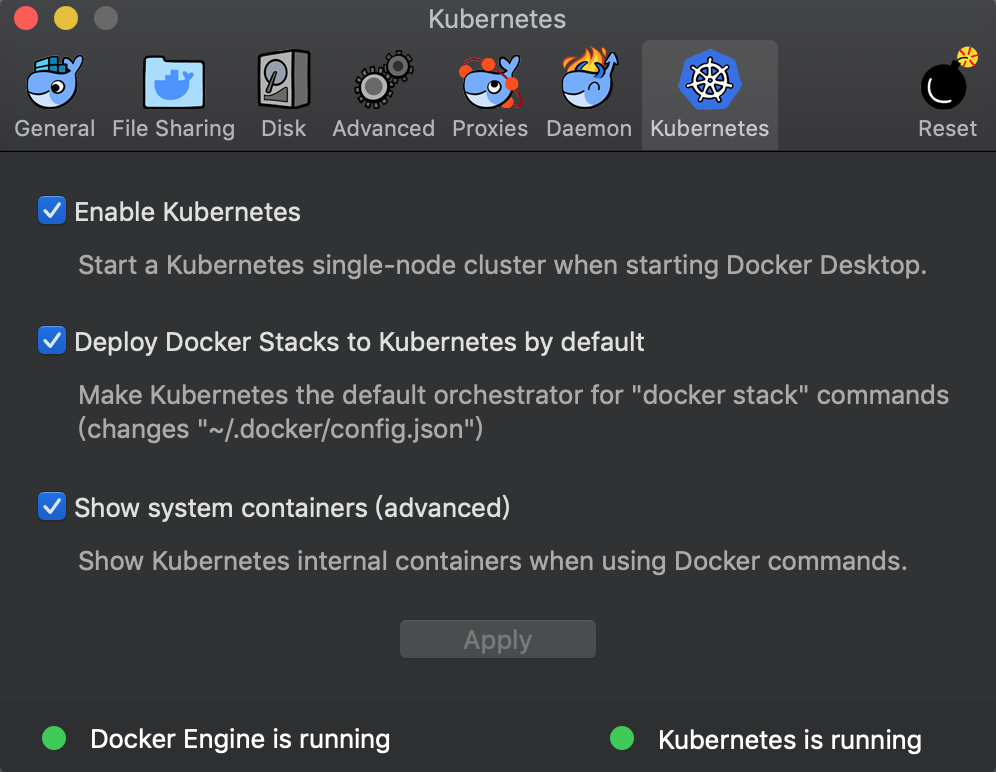

# 实验一 使用 Docker 内置的 Kubernetes 集群

## 1. 安装 Docker Desktop 

### 1.1 MAC 环境下安装 Docker for MAC

### 1.2 Windows 10 环境下安装 Docker for Windows

## 2. 启动 Docker 内置的 Kubernetes 集群
点击 Docker 鲸鱼图标 -> Preferences... -> Kubernetes，勾选
- Enable Kubernetes
- Deploy Docker Stacks to Kubernetes by default
- Show system containers(advanced)
点击 Apply，Docker 会重新启动，同时启动内置的 Kubernetes 集群。


## 3. 确认 Docker 内置的 Kubernetes 集群工作正常
查看自动安装的 Kubernetes 相关容器
```console
$ docker container ls --format "table{{.Names}}\t{{.Image }}\t{{.Command}}"
NAMES                                                                                                                   IMAGE                            COMMAND
k8s_compose_compose-api-6757787584-d7zsl_docker_9ddb62e0-750f-11e9-9c87-025000000001_0                                  docker/kube-compose-api-server   "/api-server --kubec…"
k8s_compose_compose-74649b4db6-zclv4_docker_21021466-7464-11e9-a5e0-025000000001_0                                      docker/kube-compose-controller   "/compose-controller…"
k8s_sidecar_kube-dns-86f4d74b45-7zr8j_kube-system_c3658298-7237-11e9-bffb-025000000001_0                                6f7f2dc7fab5                     "/sidecar --v=2 --lo…"
k8s_dnsmasq_kube-dns-86f4d74b45-7zr8j_kube-system_c3658298-7237-11e9-bffb-025000000001_0                                c2ce1ffb51ed                     "/dnsmasq-nanny -v=2…"
k8s_kubedns_kube-dns-86f4d74b45-7zr8j_kube-system_c3658298-7237-11e9-bffb-025000000001_0                                80cc5ea4b547                     "/kube-dns --domain=…"
k8s_kube-proxy_kube-proxy-vpg7m_kube-system_c338829d-7237-11e9-bffb-025000000001_0                                      7387003276ac                     "/usr/local/bin/kube…"
k8s_POD_compose-api-6757787584-d7zsl_docker_9ddb62e0-750f-11e9-9c87-025000000001_0                                      k8s.gcr.io/pause-amd64:3.1       "/pause"
k8s_POD_kube-proxy-vpg7m_kube-system_c338829d-7237-11e9-bffb-025000000001_0                                             k8s.gcr.io/pause-amd64:3.1       "/pause"
k8s_POD_kube-dns-86f4d74b45-7zr8j_kube-system_c3658298-7237-11e9-bffb-025000000001_0                                    k8s.gcr.io/pause-amd64:3.1       "/pause"
k8s_POD_compose-74649b4db6-zclv4_docker_21021466-7464-11e9-a5e0-025000000001_0                                          k8s.gcr.io/pause-amd64:3.1       "/pause"
k8s_kube-scheduler_kube-scheduler-docker-for-desktop_kube-system_b6155a27330304c86badfef38a6b483b_0                     d2c751d562c6                     "kube-scheduler --ad…"
k8s_kube-apiserver_kube-apiserver-docker-for-desktop_kube-system_c158ce5b29225e1de9a2153c231532c8_0                     e851a7aeb6e8                     "kube-apiserver --ad…"
k8s_etcd_etcd-docker-for-desktop_kube-system_a3b09d6f4b2a75e76bab2b9be7266eed_0                                         52920ad46f5b                     "etcd --listen-clien…"
k8s_kube-controller-manager_kube-controller-manager-docker-for-desktop_kube-system_49730b387e8bebf0751e355aee021543_0   978cfa2028bf                     "kube-controller-man…"
k8s_POD_kube-apiserver-docker-for-desktop_kube-system_c158ce5b29225e1de9a2153c231532c8_0                                k8s.gcr.io/pause-amd64:3.1       "/pause"
k8s_POD_etcd-docker-for-desktop_kube-system_a3b09d6f4b2a75e76bab2b9be7266eed_0                                          k8s.gcr.io/pause-amd64:3.1       "/pause"
k8s_POD_kube-scheduler-docker-for-desktop_kube-system_b6155a27330304c86badfef38a6b483b_0                                k8s.gcr.io/pause-amd64:3.1       "/pause"
k8s_POD_kube-controller-manager-docker-for-desktop_kube-system_49730b387e8bebf0751e355aee021543_0                       k8s.gcr.io/pause-amd64:3.1       "/pause"
```
>说明：关于各个容器的作用，请参考[这里](https://github.com/kubernetes/kubernetes/tree/master/build) 。

查看自动安装的 namespaces
```console
$ kubectl get namespaces
NAME          STATUS   AGE
default       Active   4d
docker        Active   4d
kube-public   Active   4d
kube-system   Active   4d
```

查看自动安装的 kube-system namespace 中的 pods
```console
$ kubectl get pods --namespace kube-system
NAME                                         READY   STATUS    RESTARTS   AGE
etcd-docker-for-desktop                      1/1     Running   0          4d
kube-apiserver-docker-for-desktop            1/1     Running   0          4d
kube-controller-manager-docker-for-desktop   1/1     Running   0          4d
kube-dns-86f4d74b45-7zr8j                    3/3     Running   0          4d
kube-proxy-vpg7m                             1/1     Running   0          4d
kube-scheduler-docker-for-desktop            1/1     Running   0          4d
```

查看 python-voting-web-app\docker-compose.yaml 中的端口，默认使用8080 端口。
```yaml
version: '3'
services:
  azure-vote-back:
    image: redis
    container_name: azure-vote-back
    ports:
        - "6379:6379"

  azure-vote-front:
    build: ./azure-vote
    image: azure-vote-front
    container_name: azure-vote-front
    environment:
      REDIS: azure-vote-back
    ports:
        - "8080:80"
 ```

## 2. 使用 docker-compose 命令构建 Docker 镜像
```console
$ cd python-voting-web-app
$ docker-compose up --build -d
```
>说明：--build 参数表示启动容器前，重新构建镜像；-d 表示 Detached mode，即后台启动容器。

```console
$ docker images
REPOSITORY                                       TAG                 IMAGE ID            CREATED             SIZE
azure-vote-front                                 latest              05806549d652        7 seconds ago       946MB
redis                                            latest              5958914cc558        4 weeks ago         94.9MB
tiangolo/uwsgi-nginx-flask                       python3.6           1947008ccef7        5 weeks ago         945MB
```
```console
$ docker ps
CONTAINER ID        IMAGE               COMMAND                  CREATED             STATUS              PORTS                           NAMES
c83cb78e3eaf        redis               "docker-entrypoint.s…"   19 seconds ago      Up 17 seconds       0.0.0.0:6379->6379/tcp          azure-vote-back
81b97f470dcf        azure-vote-front    "/entrypoint.sh /sta…"   19 seconds ago      Up 17 seconds       443/tcp, 0.0.0.0:8080->80/tcp   azure-vote-front
```

## 3. 在本地测试应用程序
访问 http://localhost:8080


## 4. 停止并删除容器
```console
$ docker-compose stop
$ docker-compose down
```
