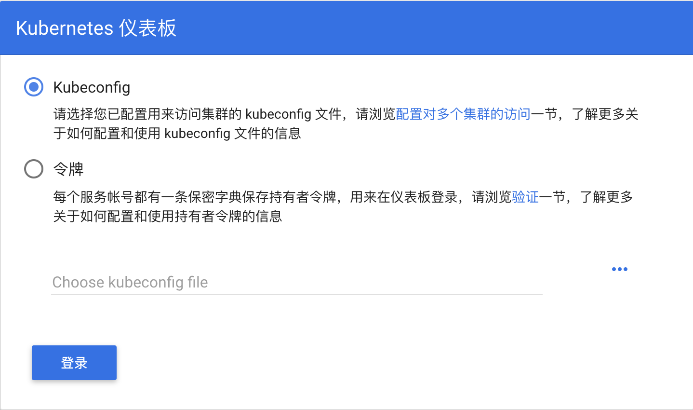

# 实验二 安装和配置 Kubernetes Dashboard

## 1. 安装 kubernetes-dashboard 服务

```console
$ kubectl apply -f https://raw.githubusercontent.com/kubernetes/dashboard/v1.10.1/src/deploy/recommended/kubernetes-dashboard.yaml
secret/kubernetes-dashboard-certs created
serviceaccount/kubernetes-dashboard created
role.rbac.authorization.k8s.io/kubernetes-dashboard-minimal created
rolebinding.rbac.authorization.k8s.io/kubernetes-dashboard-minimal created
deployment.apps/kubernetes-dashboard created
service/kubernetes-dashboard created
```

```console
$ kubectl get deployments --namespace kube-system
NAME                   DESIRED   CURRENT   UP-TO-DATE   AVAILABLE   AGE
kube-dns               1         1         1            1           4d
kubernetes-dashboard   1         1         1            1           11m
```

## 2. 访问 kubernetes-dashboard 服务

```console
$ kubectl proxy
Starting to serve on 127.0.0.1:8001
```

访问 http://localhost:8001
```yaml
{
  "paths": [
    "/api",
    "/api/v1",
    "/apis",
    "/apis/",
    "/apis/admissionregistration.k8s.io",
    "/apis/admissionregistration.k8s.io/v1beta1",
    "/apis/apiextensions.k8s.io",
    "/apis/apiextensions.k8s.io/v1beta1",
    "/apis/apiregistration.k8s.io",
    "/apis/apiregistration.k8s.io/v1",
    "/apis/apiregistration.k8s.io/v1beta1",
    "/apis/apps",
    "/apis/apps/v1",
    "/apis/apps/v1beta1",
    "/apis/apps/v1beta2",
    "/apis/authentication.k8s.io",
    "/apis/authentication.k8s.io/v1",
    "/apis/authentication.k8s.io/v1beta1",
    "/apis/authorization.k8s.io",
    "/apis/authorization.k8s.io/v1",
    "/apis/authorization.k8s.io/v1beta1",
    "/apis/autoscaling",
    "/apis/autoscaling/v1",
    "/apis/autoscaling/v2beta1",
    "/apis/batch",
    "/apis/batch/v1",
    "/apis/batch/v1beta1",
    "/apis/certificates.k8s.io",
    "/apis/certificates.k8s.io/v1beta1",
    "/apis/compose.docker.com",
    "/apis/compose.docker.com/v1beta1",
    "/apis/compose.docker.com/v1beta2",
    "/apis/events.k8s.io",
    "/apis/events.k8s.io/v1beta1",
    "/apis/extensions",
    "/apis/extensions/v1beta1",
    "/apis/networking.k8s.io",
    "/apis/networking.k8s.io/v1",
    "/apis/policy",
    "/apis/policy/v1beta1",
    "/apis/rbac.authorization.k8s.io",
    "/apis/rbac.authorization.k8s.io/v1",
    "/apis/rbac.authorization.k8s.io/v1beta1",
    "/apis/storage.k8s.io",
    "/apis/storage.k8s.io/v1",
    "/apis/storage.k8s.io/v1beta1",
    "/healthz",
    "/healthz/autoregister-completion",
    "/healthz/etcd",
    "/healthz/ping",
    "/healthz/poststarthook/apiservice-openapi-controller",
    "/healthz/poststarthook/apiservice-registration-controller",
    "/healthz/poststarthook/apiservice-status-available-controller",
    "/healthz/poststarthook/bootstrap-controller",
    "/healthz/poststarthook/ca-registration",
    "/healthz/poststarthook/generic-apiserver-start-informers",
    "/healthz/poststarthook/kube-apiserver-autoregistration",
    "/healthz/poststarthook/rbac/bootstrap-roles",
    "/healthz/poststarthook/start-apiextensions-controllers",
    "/healthz/poststarthook/start-apiextensions-informers",
    "/healthz/poststarthook/start-kube-aggregator-informers",
    "/healthz/poststarthook/start-kube-apiserver-informers",
    "/logs",
    "/metrics",
    "/openapi/v2",
    "/swagger-2.0.0.json",
    "/swagger-2.0.0.pb-v1",
    "/swagger-2.0.0.pb-v1.gz",
    "/swagger.json",
    "/swaggerapi",
    "/version"
  ]
}
```

访问 http://localhost:8001/api/v1/namespaces/kube-system/services/https:kubernetes-dashboard:/proxy/



## 5. 排错
如果 Dashboard 有问题，可以查看和修改 Service 的配置
```console
$ kubectl -n kube-system edit service kubernetes-dashboard
```
